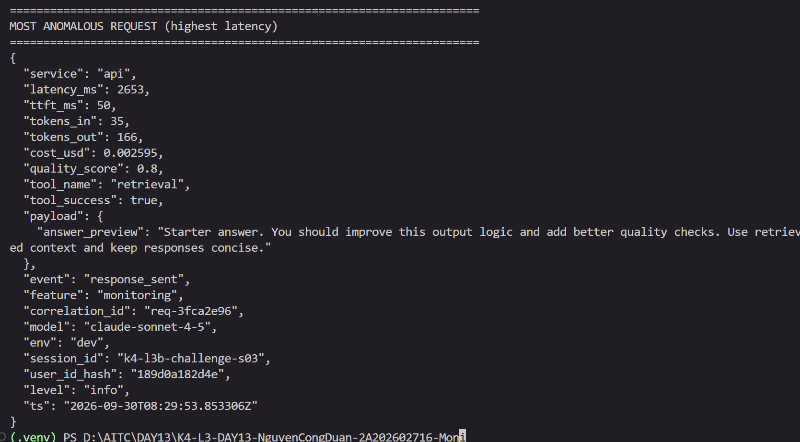
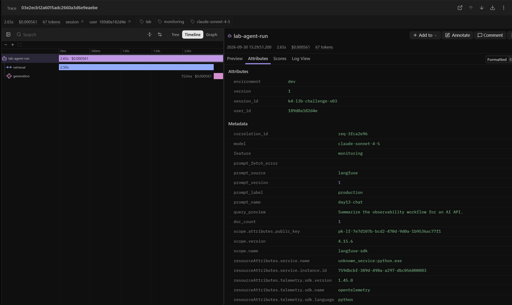
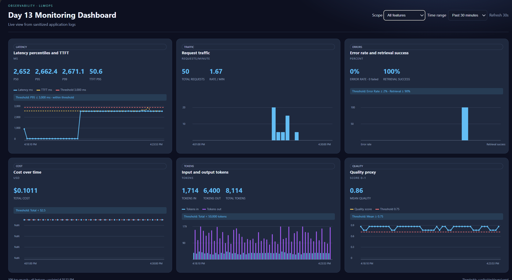

# Báo cáo cá nhân — K4-L3B Day 13 Monitoring & LLMOps

> Mỗi học viên hoàn thiện một file duy nhất này. Khi dẫn evidence, dùng đường dẫn tương đối, ví dụ `evidence/07-trace-waterfall.png`.

## 1. Thông tin học viên

- **Họ và tên:** Nguyễn Công Duẩn
- **MSSV:** 2A202602716
- **Lớp:** K4-L3B
- **Repository URL:** https://github.com/duanhap/K4-L3-DAY13-NguyenCongDuan-2A202602716-Monitoring-LLMOps
- **Commit SHA cuối:** 1091b0b9dd2bc6a804de3460a3a8bdd0a84493cc
- **Challenge ID:** `day13-k4-l3b-monitoring-llmops-v1`
- **Tên project Langfuse cá nhân:** `day13-k4-l3b-2A202602716`

## 2. Evidence index

Điền đúng đường dẫn tới evidence thực tế. Có thể đổi tên hoặc dùng nhiều ảnh nếu cần.

| Evidence | Đường dẫn |
|---|---|
| Pytest cuối | `evidence/01-pytest.png` |
| Log validator | `evidence/02-log-validator.png` |
| Dashboard validator | `evidence/03-dashboard-validator.png` |
| Structured log | `evidence/04-structured-log.png` |
| PII redaction | `evidence/05-pii-redaction.png` |
| Trace list | `evidence/06-trace-list.png` |
| Trace waterfall | `evidence/07-trace-waterfall.png` |
| Trace metadata | `evidence/08-trace-metadata.png` |
| Prompt versions | `evidence/09-prompt-versions.png` |
| Prompt rollback | `evidence/10-prompt-rollback.png` |
| Dashboard runtime | `evidence/11-dashboard-overview.png` |
| Incident metric | `evidence/12-incident-metric.png` |
| Incident log | `evidence/13-incident-log.png` |
| Incident trace | `evidence/14-incident-trace.png` |

## 3. Kết quả kỹ thuật

| Nội dung | Baseline | Kết quả cuối | Nhận xét |
|---|---|---|---|
| `validate_logs.py` | 30/100 (105 records; 100 thiếu required fields; 100 thiếu enrichment; 0 correlation ID hợp lệ; 0 PII leak) | 100/100 | Học viên xác nhận sau CP1 |
| `validate_dashboard.py` | 6/6 panel hợp lệ | 6/6 theo lần chạy đã báo; cần chạy lại sau cập nhật dashboard cuối | Contract xác nhận đủ sáu panel; validator không kiểm tra nội dung ảnh runtime |
| `pytest` | 22 passed | Lần chạy mới nhất: 23 passed, 1 failed vì metadata cuối của generation observation không giữ `prompt_version`; đã sửa để update cuối ghi lại prompt name/label/version/source, cần chạy lại | Chưa xác nhận pass sau bản sửa |
| Số traces hợp lệ | Chưa xác nhận ban đầu | Học viên đã xác nhận Langfuse có nhiều trace; ảnh danh sách ở `evidence/06-trace-list.png` | Chỉ ghi con số cụ thể sau khi đếm trace trong project cá nhân |
| Số PII leak | 0 ở baseline validator | 0; học viên xác nhận `validate_logs.py` đạt 100/100 | Theo lần chạy CP1 đã báo |
| Latency P95 / TTFT P95 | Chưa đo | CP3: 2652.8 ms / 50 ms trên 5 request feature `monitoring` | P95 vượt ngưỡng challenge 2000 ms nhưng thấp hơn SLO chung 3000 ms |
| Retrieval success rate | Chưa đo | 100% trong ảnh dashboard/trace đã xem | Cần dashboard screenshot mới sau cập nhật biểu đồ |

## 4. Logging và PII

- **Cách tạo/nhận và truyền correlation ID:** Middleware nhận `x-request-id` hợp lệ hoặc sinh `req-<8-hex>`, bind vào structlog context và trả về header.
- **Các metadata được ghi vào structured log:** Handler bind `user_id_hash`, `session_id`, `feature`, `model`, `env`; correlation ID được bind ở middleware.
- **Cách bảo đảm PII được scrub trước khi ghi:** Processor đệ quy scrub mọi chuỗi trong event trước JSONL file writer; baseline trước sửa có 0 PII leak theo validator.
- **Cách kiểm chứng kết quả:** CP0 baseline `validate_logs.py` 30/100; học viên xác nhận CP1 đạt 100/100 và các test PII/validator pass.

## 5. Tracing và prompt versioning

- **Cách xác nhận traces do chính tôi tạo trong project cá nhân:** Đã xác nhận trên Langfuse; nhiều traces xuất hiện trong project cá nhân.
- **Cấu trúc root/retrieval/generation observations:** Root `lab-agent-run`; child `retrieval` span ghi query đã sanitize, documents/count và tool status; child `generation` ghi model, prompt metadata, usage, cost và completion preview. Waterfall đã được xác nhận live.
- **Cách nối trace với log:** Middleware tạo/nhận `correlation_id`; ID này được ghi trong structured logs và metadata root trace. Dùng ID để đối chiếu log `response_sent` với trace rồi xem waterfall của `retrieval`/`generation`.
- **Prompt name:** `day13-chat`.
- **Version/label baseline:** Version 1, labels `baseline` và `production`.
- **Version/label candidate:** Version 2, label `candidate`.
- **Trace ID của mỗi version:** Xem trace metadata trong `evidence/08a-trace-metadata.png` và `evidence/08b-trace-metadata.png`; nếu báo cáo cần ID dạng text, bổ sung trực tiếp từ trace detail Langfuse.
- **Cách promote và rollback `production`:** Đã promote label `production` sang version 2 rồi rollback về version 1; evidence ở `evidence/10a-prompt-rollback.png` và `evidence/10b-prompt-rollback.png`.

## 6. Dashboard, SLO và alerts

- **Dashboard và sáu panel:** FastAPI dashboard tại `/dashboard`, đọc log JSONL đã scrub; latency P50/P95/P99 + TTFT P95, traffic, errors/retrieval success, cost, tokens và quality; mặc định 60 phút, refresh 30 giây. Đã bổ sung biểu đồ theo thời gian/request và bộ lọc `Challenge feature`; cần chụp lại `11-dashboard-overview.png` sau khi kiểm tra trục cost đã hết NaN.
- **SLO và lý do chọn:** 99.5% request thành công trong ≤3000 ms theo cửa sổ 28 ngày.
- **Cách tính error budget:** `100% - 99.5% = 0.5%`; tối đa 50 request không đạt trên tổng 10,000 request.
- **Ba alert và runbook tương ứng:** `HighLatencyP95` (>3000 ms trong 5 phút), `HighRequestErrorRate` (>2% trong 5 phút), `LowQualityScore` (mean <0.75 trong 10 phút); cấu hình tại `config/alert_rules.yaml`, runbook tại `docs/alerts.md`.

> Ví dụ cách viết error budget: "SLO 99.5% trong 28 ngày nghĩa là error budget 0.5%. Nếu workload có 10,000 request thì tối đa 50 request được phép lỗi hoặc chậm hơn ngưỡng SLO."

## 7. Điều tra challenge

- **Challenge ID:** `day13-k4-l3b-monitoring-llmops-v1`
- **Khoảng thời gian điều tra:** `2026-09-30T08:29:40Z` – `2026-09-30T08:29:54Z` (UTC)
- **Triệu chứng từ metrics:** Latency P95 đạt **2652.8 ms**, vượt ngưỡng riêng của challenge **2000 ms**; giá trị này vẫn thấp hơn SLO chung **3000 ms**. TTFT P95 là 50 ms, nên generation không có dấu hiệu chậm tương ứng. Cả 5 request feature `monitoring` đều có latency khoảng 2652–2653 ms.
- **Log line và correlation ID liên quan:**
  - Request chậm nhất: `correlation_id=req-3fca2e96`, `latency_ms=2653`, `ts=2026-09-30T08:29:53.853306Z`
  - Log `request_received`: `ts=2026-09-30T08:29:51.199167Z` → `response_sent`: `ts=2026-09-30T08:29:53.853306Z` → delta = **2654 ms**
  - Tất cả 5 correlation IDs bị ảnh hưởng: `req-97620868`, `req-95e9f068`, `req-4dc33d0a`, `req-0732a9d4`, `req-3fca2e96`
  - Xem: 
- **Trace ID và span gây ảnh hưởng:** Trace ID `03e2ecb12a6015adc2660a3d6e9eaebe`, correlation ID `req-3fca2e96`. Langfuse waterfall ghi tổng ~2.65 s, retrieval ~2.50 s, generation ~152 ms. Xem: 
- **Root cause:** Incident `rag_slow` được kích hoạt làm hàm `retrieve()` trong `app/mock_rag.py` sleep 2.5 giây trước khi trả về documents. TTFT không bị ảnh hưởng (token đầu tiên từ LLM vẫn nhanh) vì bottleneck nằm hoàn toàn ở bước RAG retrieval, trước khi LLM bắt đầu generate. Tín hiệu chẩn đoán: latency tổng tăng ~17x, TTFT không đổi → retrieval là span chậm.
- **Fix action:** Tắt incident bằng `POST /incidents/rag_slow/disable` (hoặc `python scripts/inject_incident.py --disable`). Trong production: kiểm tra kết nối vector store, timeout configuration, và circuit breaker của retrieval service.
- **Preventive measure:** Giữ alert SLO `HighLatencyP95` ở ngưỡng 3000 ms và thêm early-warning theo ngưỡng challenge 2000 ms để phát hiện retrieval degradation trước khi vi phạm SLO. Đặt timeout riêng cho retrieval (ví dụ 1 giây); khi timeout, fallback sang cached docs hoặc phản hồi không có context.
  3. Tách metric `retrieval_latency_ms` riêng biệt (hiện nay chỉ có `latency_ms` tổng) để alert chính xác hơn.
  4. Runbook tại `docs/alerts.md` hướng dẫn: metric spike → lọc log theo correlation_id → mở trace waterfall → kiểm tra retrieval span duration.

> Evidence chuỗi đầy đủ:  →  → 

## 8. Giải thích và tự đánh giá

- **Một quyết định kỹ thuật quan trọng và lý do:** Giữ ngưỡng SLO chung 3000 ms theo contract, đồng thời thêm chế độ dashboard `Challenge feature` với ngưỡng challenge 2000 ms. Cách này làm rõ cảnh báo sớm của bài thực hành mà không thay đổi SLO vận hành chung.
- **Một lỗi/blocker đã gặp:** Trace ban đầu chưa xuất hiện trên Langfuse và prompt label `production` vẫn được dùng dù đã đổi biến môi trường.
- **Cách tìm nguyên nhân và xử lý:** Đối chiếu trạng thái server, request load test, metadata `prompt_label`/`prompt_version` trên trace; phân biệt log server với thời gian chờ phía client khi chạy concurrency; khởi động lại API sau thay đổi cấu hình và xác nhận trace mới trong đúng project.
- **Cách hiểu luồng Metrics → Logs → Traces:** Dashboard phát hiện P95 vượt ngưỡng; correlation ID tìm request tương ứng trong JSONL; cùng ID trong metadata trace mở ra waterfall để xác định span retrieval chậm; cuối cùng ghi root cause, hành động xử lý và biện pháp phòng ngừa.
- **Vai trò của prompt version, token/cost, SLO hoặc rollback trong vận hành LLM:** Version/label giúp kiểm soát prompt đang chạy và rollback nhanh; token/cost đo hiệu quả; SLO và error budget lượng hóa độ tin cậy; trace cho phép quy nguyên nhân theo từng request.
- **Điều quan trọng nhất đã học:** Không kết luận từ một con số tổng hợp duy nhất; phải nối metric, log và trace qua cùng correlation ID, đồng thời phân biệt ngưỡng cảnh báo sớm với SLO chính.
- **Hạn chế hoặc phần chưa hoàn thành, nếu có:** CP4 còn cần chạy lại pytest và hai validator sau cập nhật dashboard cuối, chụp mới dashboard overview và incident metric, rồi ghi commit SHA. Hai ảnh 11 và 12 hiện trùng nhau nên ảnh 12 chưa chứng minh chế độ challenge; ảnh overview trước đó có trục cost hiển thị NaN.

## 9. Checklist trước khi nộp

- [ ] Kết quả và evidence thuộc commit SHA cuối.
- [ ] Tất cả ảnh/output mở được bằng đường dẫn tương đối.
- [ ] Incident metric → log → trace: log/trace evidence đã có; thay ảnh metric hiện tại (đang trùng overview) bằng ảnh Challenge feature sau cập nhật dashboard.
- [ ] Trace/prompt evidence thuộc project Langfuse cá nhân và ảnh không lộ key/secret.
- [ ] Repository chạy lại được theo README.
- [ ] Không có secret, API key, PII thô hoặc evidence của người khác/lớp khác.
- [ ] URL repo và commit SHA cuối đã được nộp trên LMS/Codelabs.
